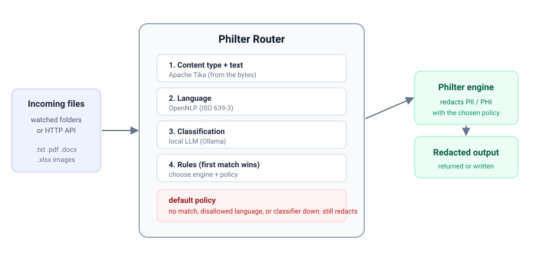

# Philter Router

Philter Router routes files to a [Philter](https://github.com/philterd/philter) redaction policy and
engine based on file attributes, then forwards each file for redaction. It is the single front door in
front of one or more Philter engines: hand it a file and it decides the policy and the engine.

Read the announcement: [Introducing Philter Router: The Right Policy for Every File](https://philterd.ai/blog/introducing-philter-router-the-right-policy-for-every-file/).



A file's route is chosen from its attributes:

- **content type** (detected from the bytes with Apache Tika, not just the extension),
- **filename** extension,
- **containing directory**, and
- a **classification** from a local LLM (Ollama).

A file that matches no route, or whose language is not allowed, or whose classifier is unavailable,
falls to the mandatory **default**. The default either redacts with a policy or, with `action: reject`,
refuses the file (quarantined to `error` by the watcher, `422` over the API). No file is ever passed
through unredacted.

## Status

Two entry points share one routing pipeline (Tika extraction and content-type detection, OpenNLP
language detection, Ollama classification, ordered rules with the language gate and safe default),
forwarding to Philter via `philter-sdk-java`, with audit logging and fail-closed configuration
validation:

- **Folder-watcher** - watch directories and redact files as they arrive.
- **HTTP API** - a Philter-compatible, send-only front end (`/api/health` and `/api/filter` for text and files).

Enable either or both in the config; the router starts whatever is configured.

## Build

```
mvn package
```

Produces a runnable `target/philter-router.jar` (Java 25).

## Run

```
java -jar target/philter-router.jar /path/to/router.yaml
```

To also write rolling log files (on-prem / Windows-service), set the log directory:

```
java -Drouter.log.dir=/var/log/philter-router -jar target/philter-router.jar router.yaml
```

By default the router logs to stdout (operational logs and the structured audit trail both go to the
console).

## HTTP API

Enable the API with a `server` block (see [`examples/http-api.yaml`](examples/http-api.yaml)):

```yaml
server:
  enabled: true
  port: 8080
```

It mirrors Philter's filter contract, so the Philter SDK works against it unchanged. The router is
send-only (redact and return). The policy is auto-selected by the routes unless `?p=` overrides it; the
engine is always chosen by routing.

| Endpoint | Description |
| --- | --- |
| `GET /api/health` | Liveness. |
| `POST /api/filter` | Redact and return synchronously. Send a file with `?filename=` (body is the raw bytes); otherwise the body is text. `?p=` overrides the policy, `?c=` sets the context, `X-Source-Directory` supplies a directory hint. The applied policy is in `X-Philter-Policy` and the document id in `x-document-id`. |

```
curl -X POST --data-binary 'His SSN is 123-45-6789.' localhost:8080/api/filter
curl -X POST --data-binary @report.docx 'localhost:8080/api/filter?filename=report.docx' -o redacted.docx
```

The API is a Spring Boot application (matching Philter). Spring Boot Actuator adds operational
endpoints alongside the Philter-compatible ones: `GET /actuator/health` (liveness/readiness) and
`GET /actuator/prometheus` (metrics). An OpenAPI 3 spec is served at `GET /openapi.yaml`.

## Batch redaction

To redact an existing directory tree, drive the API from a client that walks the tree and POSTs each
file; the router stays a stateless gateway. [`scripts/redact-tree.sh`](scripts/redact-tree.sh) is a
reference client (only `curl` and `find` needed) that mirrors the input tree into an output directory
and is resumable:

```
scripts/redact-tree.sh --in /data/src --out /data/redacted --url https://localhost:8080 --insecure
```

See [Batch Redaction](docs/docs/batch.md) for options and other clients.

## Configuration

A single YAML file. See the [`examples/`](examples/) directory for complete, commented configurations
(minimal, folder watching, HTTP API, both, classifier routing, and network shares). Enable the API
(`server`) and/or folder watching (`watch.locations`); at least one is required. Top-level blocks:

- **`watch.locations`** - the directories to watch. Each location sets its own `mode` (`poll`, the
  default, required on network shares; or `notify`, low-latency, local filesystems only), plus
  `pollIntervalMs`, `stableForMs`, `recursive`, and the `output` / `done` / `error` directories.
- **`engines`** - named Philter engines (`name -> url`), referenced by routes.
- **`classifiers`** - named local LLM classifiers. Each has an `endpoint`, `model`, `prompt` (with a
  `{{text}}` placeholder), a fixed `labels` list, and a `timeoutMs`. A classifier runs at most once per
  file and its result is cached.
- **`routes`** - an ordered list, first match wins. Each route has a `match` (`contentTypes`,
  `extensions`, `directories`, `classification`), an optional `languages` list of ISO 639-3 codes
  (defaults to `[eng]`; use `any` to accept all), and an outcome (`engine` + `policy`).
- **`default`** - the mandatory catch-all outcome: an `engine` + `policy` that redacts, or `action: reject`
  to refuse unmatched files. The router refuses to start without it.

### Match semantics

Within a route all specified `match` fields must match (AND); within one field a list is any-of (OR).
For OR across fields, use two routes. The `languages` gate is AND-ed with the match.

### Evaluation tiers

Routing is tiered so expensive work runs only when needed:

1. cheap metadata (content type, extension, directory),
2. language detection (needs extracted text; local, cheap),
3. classification (needs extracted text and an LLM call).

A route that fails a cheaper tier never triggers a more expensive one. Extracted text is lossy,
classification-only, and never written as output or logged.

## License

Apache License 2.0.
